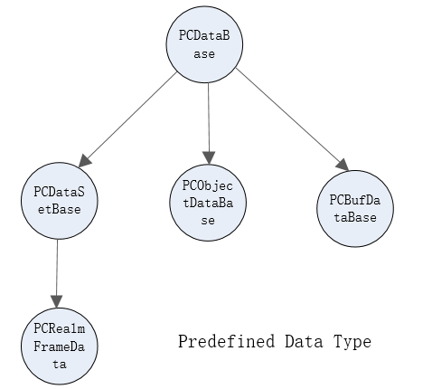

<h1 align="center">PCDataBase</h1>

The base classes for data management are PCDataBase,PCDataSetBase,PCObjectDataBase and PCBufDataBase. PCDataSetBase and PCObjectDataBase inherits the methods in PCDataBase. 



* PCDataSetBase     : Record multiple data objects
* PCObjectDataBase  : Record one CLE object, maybe a proc, chain, cell or data
* PCBufDataBase     : Record a ParaPkg
* PCRealmFrameData  : Generated by realm after each schedule, records input envdata and the data objects generated during the scheduling process


define data management type
------

The data type class is a subclass derived from PCPyDataClass. This subclass may override these functions: Load, Save, ToString, ToParaPkg, Dup and Equals. Where Load is used to recover from a string, the method must be defined as a static method of the subclass; Save is used to store the data object as a string; "Dup" function returns a copy; ToString returns a string for display; ToParaPkg change data to parapkg; Equals returns True if two instance's value are equal.

PCPyDataClass encapsulates a python object (which can be an integer, a string, an instance of a class, etc.), provided when the instance is created, and gets the wrapped python object via the value() function.

```python
class PCPyDataClass :
  def __init__(self,val) :
    self.val = val
    
  ...
  
  def value(self) :
    return self.val    
```

There are two ways to create data types and data instances:

**1. define data class with python and register it to pchain**

```python
import pchain
from pchain import pydata
from pchain.pydata import PCPyDataClass

class floatclass(PCPyDataClass) :
  pass
    
pydata.Register(floatclass)  
floattype = floatclass.GetType()
```

* The "save" function is used to store a data instance as a string, which is called when the data object is stored.


* The "Load" function must be defined as a static function that restores a data object instance from a string returned by the "Save" function.The input parameter type is a string or parapkg. If it is parapkg, it needs to check the data type and integrity when loading. If it is not loaded correctly, it will return None.


* "ToString" function returns a displayable string.


* "ToParaPkg" Stores the data in a parameter package, returning True if successful, otherwise returns False. This function is called when the data type instance needs to be accessed in other languages by the function GetDataBuf of the encapsulated cle object.


* "Dup" function returns a copy.


* "Equals" function returns True, if two instance's value are equal.

Other functions are customized as needed.

**[Create subclasses of data management types](#)**

```python
class IntegerClass(NumberClass) :
  pass
pydata.Register(IntegerClass) 
```

**2. Create instance of data management types**

Set the value when creating the instance. During the running, do not modify the value of the instance. If a new value is required, it is achieved by creating a new instance.

You can create an instance of an instance. At this time, the created instance is similar to a copy. They are equal and have the same Tag, which can be considered as the same object. You cannot set a value and share data with the original instance. Newly created instances can be assigned to processes

For example,

For instances created by python classes

```python 
a = NumberClass(123)
b = a.Wrap()()
c = b()
#b is instance of a, and b is a cle object.
print(a.Equals(b))
print(a.GetTag())
print(b.GetTag())
print(c.GetTag())
```

For instances is cle object

```python 
a = NumberClass(123).Wrap()
b = a()
#b is instance of a, and b is a cle object.
print(a.Equals(b))
print(a.GetTag())
print(b.GetTag())
```

**3. define data class using DefineType/DefineTypeEx/DefineSubType**

> * DefineType : DefineType(tpname,rawtype=None), rawtype is a python type or class
> * DefineSubType : DefineSubType(parenttype,tpname,rawtype = None), rawtype is a python type or class
> * DefineTypeEx : DefineType(datatype,tpname,rawtype=None), rawtype is a python type or class. datatype is the data base type which has properties 

*[Using value() function to get the wrapped python object](#)*

```python
pydata.DefineType('DiskPathClass')
pydata.DefineType('Rawlass',type(''))

class myclass :
  pass 
class mysubclass(myclass) :
  pass  
  
pydata.DefineType('RawMyClass',myclass)
pydata.DefineSubType(RawMyClass,'RawMySubClass',mysubclass)

inst = RawMySubClass(mysubclass())
```

```python
newtype = Service.PCDataBase.CreateType('DataHasProperty')
newtype.CreateProperty('Attr1',libstarpy.TYPE_CHARPTR,'')
pydata.DefineTypeEx(newtype,'NumberClass')

re = NumberClass(val)
re.Wrap().Attr1 = 'From input'
```

The data management type defined by this method, using the following template

```python
class {0}(PCPySimpleDataClass) :
    rawtype = pyrawtype
    
    def __init__(self,val) :
      if self.rawtype == None :
        self.val = val
      else :
        import inspect
        if (inspect.isclass(self.rawtype) == True and isinstance(val,self.rawtype)) or (type(val) == self.rawtype) :
          self.val = val
        else :     
          raise Exception('create data instance failed, input ',val,'is not instance of ',self.rawtype)
          
    @staticmethod
    def Load(MetaData) :
      # MetaData maybe string or parapkg
      # raise Exception('Load function is not defined ')
      import pickle
      import base64
      if type(MetaData) == type('') :
        return {0}(pickle.loads(base64.b64decode(MetaData)))
      else :
        raise Exception('Load from ParaPkg is not supported ')
    def Save(self) :
      #raise Exception('Save function is not defined for '+str(self))   
      import pickle
      import base64    
      return base64.b64encode(pickle.dumps(self.val))  
      
pydata._Register({0},StarNameSpace)
```

**The data management type defined by this method does not support ToParaPkg and Load method, therefore it can not access from other language. [You can add these two functions dynamically](#)**

**[Note: Save function must be add corresponding to Load](#)**

for example,

```python
class NumberClass(PCPyDataClass) :
  @staticmethod
  def Load(MetaData) :
    # MetaData maybe string or parapkg
    # raise Exception('Load function is not defined ')
    if type(MetaData) == type('') :
      return NumberClass(float(MetaData))
    else :
      return NumberClass(MetaData[0])
  def Save(self) :
    #raise Exception('Save function is not defined for '+str(self))   
    return str(self.num) 

  def ToParaPkg(self,parapkg) :
    parapkg[0] = self.num
    return True
pydata.Register(NumberClass)  
```

create data instance
------

An instance of a data management object is used to manage data, both of which are created simultaneously.

1. Using function "Create" 

```python
val1 = floattype.Create(123.4)
```

2. using python class 

```python
val1 = floatclass(123.4).Wrap()   # get data management object, which is a cle object
rawval = pydata.UnWrap(val1)      # get the corresponding python instance
```

**It is recommended to use the second method to effectively manage the data. Most of the examples in this document use the second method.**

Propertiess supported by data management  cle object
---

*[ScheduleTickCount : int64](#)*

tick when data is generated, it's value is set by runner automatically, valid in realm.

**[In addition, each data object has a UniformTick that represents the system time and can be obtained by GetUniformTick.](#)**

Functions supported by data management cle objects
------

#### a. basic function

*[Create](#)*

For data types defined by python, data instances can be generated directly without calling the function.

If the data type is a class inherited from PCPyDataClass, the function wraps the input parameters into ParaPkg and calls the Load function.

`void *Create(...)`

*[GetDataBuf](#)*

For data types defined by python, data instances generated directly from the PCPyDataClass are usually directly accessible without calling the function.

For the data instance generated from the class inherited from PCPyDataClass, the function calls the ToParaPkg function of PCPyDataClass to store the data in ParaPkg.

`VS_PARAPKGPTR GetDataBuf()`

*[GetType](#)*

return data type.

```python
t = val1.GetType()
t == floattype
```

*[GetTypeName](#)*

return type name.

`VS_CHAR *GetTypeName()`

*[SetSignature](#)*

Set the Signature, objects of the same type and the same Signature are considered the same, regardless of whether the values are the same.

**[If the Signatures of the data objects are the same, then their tags are same.](#)**

`void SetSignature(VS_CHAR *Signature)`

*[GetSignature](#)*

return Signature. If not set, return an empty string.

`VS_CHAR *GetSignature()`

*[GetTag](#)*

If the data object is a management type, the name of the object is returned. Otherwise, return a string corresponding to the data.

Tag is a string of 40 characters

**[data with same type and same tag should be considered as the same object](#)**

**[For python2 and python3, the tag values are different. To avoid this problem, you should define the function OnSave for the data type. For python2 and python3, return the same value.](#)**

`VS_CHAR *GetTag()`

*[GetTagLabel](#)*

Get tab label, format is "data_"+namespace+type name.

`VS_CHAR *GetTagLabel()`

*[SetUniformTick](#)*

Set UniformTick with current time, usually do not call this function, the data object is automatically set when it is created.

`void SetUniformTick()`

*[GetUniformTick](#)*

Get UniformTick.

`VS_INT64 GetUniformTick()`

*[AddSource](#)*

Used to support absolute attributes

`VS_BOOL AddSource(void *SourceData)`

**[This function is also defined in Python's PCPyDataClass and can be called directly.](#)**

```python
pydata.DefineType('DiskPathClass')

a = DiskPathClass('sadfasdf')
b = DiskPathClass('ddddddddd')
c = DiskPathClass('ddddddddddddddddd')

b.AddSource(a)
c.AddSource(b)
print(b.IsChangedFrom(a))
print(c.IsChangedFrom(a))
```

*[IsChangedFrom](#)*

There is an object with the same type exists in the source object sequence, and the input object is the source object.

`VS_BOOL IsChangedFrom(void *SourceData)`

**[The same function is also defined in Python's PCPyDataClass and can be called directly.](#)**

*[GetSourceData](#)*

`VS_PARAPKGPTR GetSource()`

Data Objects in SourceData are arranged in order

*[IsSource](#)*

`VS_BOOL IsSource(struct StructOfPCDataBase *SourceData,VS_BOOL MustDirect)`

*[Equals](#)*

two data are equal or not

`VS_BOOL Equals(struct StructOfPCDataBase *PCData)`

*[IsSame](#)*

Whether the two data objects are the same, the same is not necessarily equal, especially in the time variation sequence. 

Two objects of the same type are set with tags and the tags are the same, or none of the tags are set and the values are equal.

`VS_BOOL IsSame(struct StructOfPCDataBase *PCData)`

*[IsDataSet/IsObjectData/IsBufData/IsRealmFrameData](#)*

the data object is instance of PCDataSetBase/PCObjectDataBase/PCBufDataBase/PCRealmFrameData

`VS_BOOL IsDataSet/IsObjectData/IsBufData/IsRealmFrameData()`

*[IsInstance](#)*

the data object is instance of input Type

`VS_BOOL IsInstance(void *Type)`

*[IsBefore](#)*

Valid when two data objects belong to the same Realm, otherwise return false

`VS_BOOL IsBefore(struct StructOfPCDataBase *PCData)`

*[IsAfter](#)*

Valid when two data objects belong to the same Realm, otherwise return false

`VS_BOOL IsAfter(struct StructOfPCDataBase *PCData)`

*[Dup](#)*

Copying the data object returns a new data object. 

*[The newly generated data has nothing to do with the original data object, and does not inherit the SourceData and OwnerProc of the original object.](#)

`struct StructOfPCDataBase *Dup()`

*[GetOwnerProc](#)*

Get the process class which produced the data object

`void *GetOwnerProc()`

*[CollectType](#)*

Get a list of data types. Usually the property 'IsType' of a direct instance of PCDataBase or PCDataSetBase is true.

`VS_PARAPKGPTR CollectType()`

*[RegCallBack](#)*

Set the callback, the currently supported callback is OnFreeCallback.

```python
freecallbackobj = Service._New()
@freecallbackobj._RegScriptProc_P('OnFreeCallback')
def func(CleObj,WhichObj) :
  print(str(WhichObj),'   ',str(WhichObj.GetTag()), '  isfreed')
Service.PCDataBase.RegCallBack(freecallbackobj);
```

`void RegCallBack(void *TargetObject)`

*[UnRegCallBack](#)*

Remove the callback

*[GetDataSetBase](#)*

Get the PCDataSetBase.

`void *GetDataSetBase()`

*[GetObjectDataBase](#)*

Get the PCObjectDataBase.

`void *GetObjectDataBase()`

*[GetBufDataBase](#)*

Get the PCBufDataBase.

`void *GetBufDataBase()`

*[Wrap](#)*

This function returns itself, for compatibility with the pydata calling method.

`void *Wrap()`

*[SetReadOnly](#)*

After this function, the data value can not changed. it can not be changed again

`void SetReadOnly()`

#### b. Cache of associated data objects

*[SetCache](#)*

Cache related data objects. The first parameter is a Proc, Cell, or ProcChain. Clear the cached data object if the second argument is NULL

`VS_BOOL SetCache(void *ProcOrProcChain,void *Data)`

*[GetCache](#)*

Get cached data objects

`void *GetCache(void *ProcOrProcChain)`

*[ClearCache](#)*

Clear all cached data objects

`void ClearCache()`

#### c. Run simple proc

*[RunString](#)*

This data is used as input to execute the process string. If there are multiple output results, only the first one is returned. For more complicated, please use RunString of Realm.

`void *RunString(VS_CHAR *ProcOrProcChain)`

*[RunProc](#)*

This data is used as input to execute the process. If there are multiple output results, only the first one is returned. For more complicated, please use RunProc of Realm.

`void *RunProc(void *ProcOrProcChain)`

#### d. attach rule management

*[SetRuleAttach](#)*

Set the rules that generate the data object

`VS_BOOL SetRuleAttach(struct StructOfPCRuleBase *PCRule)`


*[GetRuleAttach](#)*

Get the rules that generate the data object

`VS_PARAPKGPTR GetRuleAttach()`


*[HasRuleAttach](#)*

Whether the data object is associated with a rule

`VS_BOOL HasRuleAttach()`

*[RemoveRuleAttach](#)*

Remove all attached rules. The data object becomes a fact

`void RemoveRuleAttach()`


*[Approved](#)*

The data object validation is valid, the function calls the callback function OnApproved for each rule associated with the data object.

`void Approved()`

*[Disapproved](#)*

The data object validation is invalid, the function calls the callback function OnDisapproved for each rule associated with the data object.

`void Disapproved()`


#### e. Run management function

*[AddReject](#)*

The data object is rejected by the process as input, and the data will not be assigned to the process again

`void AddReject(void *Proc)`

*[IsReject](#)*

Whether the data object is rejected by the process as input

`VS_BOOL IsReject(void *Proc)`


*[GetReject](#)*

Get a list of process classes that reject the data object as input

`VS_PARAPKGPTR GetReject()`

*[AddAccept](#)*

The data object is accepted by the process as input, and the data will not be assigned to the process again

`void AddAccept(void *Proc)`

*[IsAccept](#)*

Whether the data object is accepted by the process as input

`VS_BOOL IsAccept(void *Proc)`


*[GetAccept](#)*

Get a list of process classes that accept the data object as input

`VS_PARAPKGPTR GetAccept()`

**[ResetSchedule](#)**

Clear scheduling information (including Accept and Reject records) so that the data can be rescheduled again. This function causes the already executed procedure to be executed again.

`void ResetSchedule()`

*[IsFromProc](#)*

Data object is generated by the proc

`VS_BOOL IsFromProc(void *PCProc)`

#### f. Save and load function

*[SaveTo](#)*

Store the object to ParaPkg, can be converted to json string by ParaPkg._ToJSon() function.

`VS_BOOL SaveTo(VS_PARAPKGPTR ValueBuf)`

Json contains two items:
`{"PackageInfo":[],"Value":[{"Type":4,"Value":"234"},{"Type":2,"Value":5567.76}]}`
 PackageInfo : The package that the data object depends on
 Value : content


*[LoadFrom](#)*

Load the data object, the JSON string can be converted to ParaPkg by the ParaPkg._FromJSon() function, and then pass to LoadFrom.

`void* LoadFrom(VS_PARAPKGPTR ValueBuf)`

This function does not process 'PackageInfo' and needs to be processed by an external procedure before loading. If the data class or procedure class is not found during the loading process, the load fails.

**[The loaded object has no relationship with the current object,Load function can be called from any data object](#)**

```python
data = Service.PCDataBase.LoadFrom(xxxx)
```

Load the package using the loaderpackage function of the loader

```python
  Result = ProcChainPkg._FromJSon(PackageJSon)
  
  from pchain import loader
  loader.loadobjectpackage(ProcChainPkg)
```

The function needs to be called via the data type, and the function returns the result as a new instance of the data class. If it fails, it returns NULL.

Functions for defining properties of pcdata
---

The data type supports defining properties. Only possible if no instance of the data type has been created. If a data type has attributes defined, all instances of that data type and it's subtypes(including PCDataSetBase,PCObjectDataBase,PCBufDataBase) have these properties.

Cannot add properties to PCDataSetBase, PCObjectDataBase, PCBufDataBase types, or their subtypes

Each PCDataBase, if an attribute is defined, has three associated types: PCDataSetBase, PCObjectDataBase, PCBufDataBase. These three associated types can be obtained through the functions GetDataSetBase, GetObjectDataBase, GetBufDataBase

Data types with attributes and their associated PCDataSetBase, PCObjectDataBase, PCBufDataBase form a data object space.

**This feature requires CLE registered version**

**The attribute of the data has nothing to do with the Tag, the GetTag function is not affected by the attribute**

*[CreateProperty](#)*

Adding attributes to data types.

`VS_BOOL CreateProperty(VS_CHAR *PropertyName, VS_INT8 PropertyType, void *PropertyDefaultValue)`

PropertyType:
* libstarpy.TYPE_BOOL
* libstarpy.TYPE_INT32
* libstarpy.TYPE_INT64
* libstarpy.TYPE_CHARPTR
* libstarpy.TYPE_DOUBLE

example,

```python
newdata = Service.PCDataBase._New('datatype1')
newdata.CreateProperty("att1",libstarpy.TYPE_INT32,1)
```

*[IsProperty](#)*

Is property or not

`VS_BOOL IsProperty(VS_CHAR *PropertyName)`

*[HasProperty](#)*

Whether the data type or instance has attributes defined

`VS_BOOL HasProperty()`

Functions supported for python instances corresponding to cle objects 
---

For example,

```python
pydata.DefineType('DiskPathClass')
a = DiskPathClass(xxx)
a.AddSource(xxx)

# call the function via the correspnding cle objec
a.Wrap().AddSource(xxx)

```

* GetType
* AddSource
* IsChangedFrom
* SaveTo
* LoadFrom, which is a class function
* GetSource, return list
* GetOwnerProc
* IsSource
* IsSame
* IsInstance
* IsBefore
* IsAfter
* SetRuleAttach
* GetRuleAttach, return list
* HasRuleAttach
* Approved
* Disapproved
* IsReject
* AddReject
* RemoveReject
* GetReject, return list
* IsAccept
* AddAccept
* RemoveAccept
* GetAccept, return list
* ResetSchedule
* IsFromProc
* SetSignature
* GetSignature
* GetTag
* GetTagLabel
* SetUniformTick
* GetUniformTick
* SetCache
* GetCache
* ClearCache
* RunString
* RunProc
* IsProperty
* HasProperty
* GetDataSetBase
* GetObjectDataBase
* GetBufDataBase


