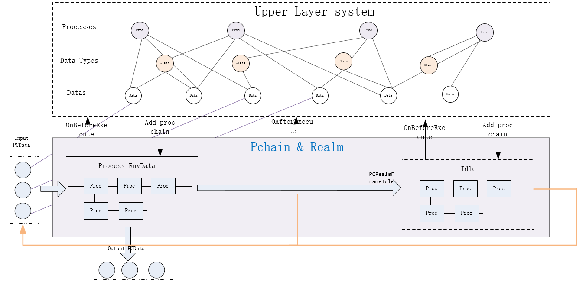
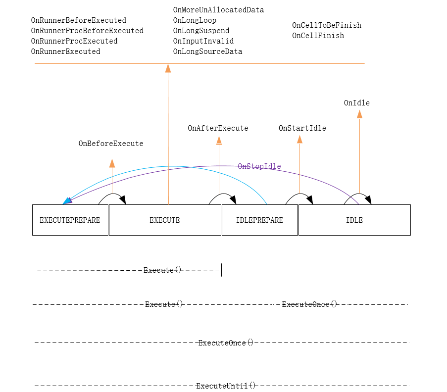

<h1 align="center">Process Chain</h1>

Multiple process are connected together to form a process chain that implements a function. The process chain is called pchain, which is a new type of programming concept and method.

The data object is managed by [pcdatabase](./pcdatabase.md), which contains the type name definition of the data, the buffer for the managed data, and the source of the data object(that is, which data is generated by the data), and the process which generates the data.

This process is managed by [pcprocbase](./pcprocbase.md), PCProc contains the process type name, the type (pcdata) and number of input data required, and the type of output data. 



The pchain scheduling is divided into four phases: EXECUTEPREPARE(0),EXECUTE(1),IDLEPREPARE(2),IDLE(3). In each stage of the scheduling, the callback function OnBeforeExecute of reaml is triggered. In the callback function, the upper layer system can retrieve the input data queue of the realm, find the process of processing the data, and add the process to the realm.

* EXECUTEPREPARE

Environment data can be added during the phase. When the functions Execute, ExecuteOnce, ExecuteUntil are called, the state will enter other phases.

Call back the function "OnBeforeExecute" before entering other phases

* EXECUTE

Schedule Cell Execution. When all the cells cannot continue to execute, enter the IDLEPREPARE phase. 

Call back to function "OnAfterExecute" before entering IDLEPREPARE. If OnAfterExecute returns true, the scheduling execution continues. Otherwise enter the IDLEPREPARE stage

* IDLEPREPARE

Call Execute/ExecuteUntil, enter the EXECUTEPREPARE phase. Call ExecuteOnce, enter the IDLE phase

Call back to the function "OnStartIdle" before entering the IDLE phase

* IDLE

Call back the function OnIdle.

Call ResetExecuteOnce/Execute/ExecuteUntil to enter the EXECUTEPREPARE phase




pchain is developed based on [CLE](https://github.com/srplab)
------

For accessing objects of cle, first step is to obtain the service group through 

```python
import sys
import os
import pchain

Service = pchain.cleinit()
import libstarpy

SrvGroup=libstarpy._GetSrvGroup(0)
```

and then get other objects through the service object.

**[Service.PCDataBase](#)** is the base class for data management objects

**[Description of the function call](#)**

* This series of documents describes the input and output of functions in C language format. Some input parameters are described as structure pointers or void *, which means that the input parameters are a CLE object. Some output results are also described as structure pointers or void *, which means that the output is a CLE object.

* For scripting languages, such as python, for the input parameters described above, you can use python's cle object directly as input.


data management structure
-----

The base classes for data management are PCDataBase and PCDataSetBase. PCDataSetBase inherits the methods in PCDataBase.  

All instances of PCDataBase are an object. An object can be either a data type or data, distinguished by the attribute "IsType", and if the object's IsType is equal to true, the data type. The data object has a buffer that can be obtained via "GetDataBuf". Buffers can store basic types of data, such as: integer, float, string, boolean, cle object.

For a detailed description of data management objects, see [pcdatabase](./pcdatabase.md)

Programming with pchain
----

Pchain is based on cle development, the core code is written in C language, can support multiple languages, and runs on multiple platforms. Currently, pchain supports python and supports windows, linux, and mac os platforms.

#### a. A Simple example

Enter two values and calculate their sum. This example gives a preliminary impression of how to use pchain.

```python
import sys
import os
import pchain
from pchain import pydata
from pchain import pyproc
from pchain.pydata import PCPyDataClass
from pchain.pyproc import PCPyProcClass

Service = pchain.cleinit()
import libstarpy

realm = Service.PCRealmBase._New()

# Define data types
pydata.DefineType('NumberClass')

# Define procedure types
@pyproc.DefineProc('InputProc',None,NumberClass)
def Execute(self) :  
  Context = self.Context  #  first must save Context in local variable
  if Context['SelfObj'].Status < 0 :
    return None
  val = input('input a number : ')
  return (4,1,NumberClass(val))

# Define procedure types
@pyproc.DefineProc('OutputProc',(NumberClass,NumberClass),None)
def Execute(self,num1,num2) :  
  Context = self.Context  #  first must save Context in local variable
  print('sum = ', num1.value() + num2.value())
  Context['Cell'].Finish()
  return (0,1,None)
    
cell = Service.PCCellBase._New()
cell.AddProc(InputProc,OutputProc)

realm.AddCell(cell)
realm.Execute()

# enter loop
# pchain.cleloop()
# finish
pchain.cleterm() 
```

output

```sh
input a number : 1
input a number : 2
('sum = ', 3)
enter loop, [ESC] to exit
```


#### b. Pchain initialization

* Load and initialize pchain

```python
import sys
import os
import pchain
from pchain import pydata
from pchain import pyproc
from pchain.pydata import PCPyDataClass
from pchain.pyproc import PCPyProcClass

Service = pchain.cleinit()
import libstarpy

realm = Service.PCRealmBase._New()
```

* End and clean up pchain

```python
pchain.cleterm() 
```

* Pchain message loop

```python
pchain.cleloop() 
```

#### c. Define data management types

* method 1

Create a subclass of PCPyDataClass that defines the "Load", "Save","ToString", "ToParaPkg", "Dup" and "Equals" functions.
For more details, see document about [pcdata](./pcdatabase.md)

```python
class floatclass(PCPyDataClass) :
  @staticmethod
  def Load(MetaData) :
    if type(MetaData) == type('') :
      return floatclass(float(MetaData))
    else :
      return floatclass(MetaData[0])
  def ToParaPkg(self,parapkg) :
    parapkg[0] = self.num
    return True    
  def Save(self) :
    return str(self.value())      
pydata.Register(floatclass)  
floattype = floatclass.GetType()
```

* method 2

Using DefineType/DefineChildType

> * DefineType : DefineType(tpname,rawtype=None), rawtype is a python type or class
> * DefineSubType : DefineSubType(parenttype,tpname,rawtype = None), rawtype is a python type or class

```python
pydata.DefineType('DiskPathClass')
pydata.DefineType('Rawlass',type(''))

class myclass :
  pass 
class mysubclass(myclass) :
  pass  
  
pydata.DefineType('RawMyClass',myclass)
pydata.DefineSubType(RawMyClass,'RawMySubClass',mysubclass)

inst = RawMySubClass(mysubclass())
```

**The data management type defined by this method does not support ToParaPkg and Load from parapkg method, therefore it can not access from other language. [You can add these two functions dynamically](#)**

**[Note: Save function must be add corresponding to Load](#)**

for example,

```python
pydata.DefineType('NumberBaseClass')
class NumberClass(NumberBaseClass) :
  @staticmethod
  def Load(MetaData) :
    # MetaData maybe string or parapkg
    # raise Exception('Load function is not defined ')
    if type(MetaData) == type('') :
      return NumberClass(float(MetaData))
    else :
      return NumberClass(MetaData[0])
  def ToParaPkg(self,parapkg) :
    parapkg[0] = self.value()
    return True
  def Save(self) :
    return str(self.value())      
pydata.Register(NumberClass)  
```

#### d. Define process management type

* method 1

Create a subclass of PCPyProcClass that defines the "Execute" functions.
For more details, see document about [pcproc](./pcprocbase.md)

```python
class MyNumberProc(PCPyProcClass) :
  def Execute(self,Value) :  
    Context = self.Context  #  first must save Context in local variable
    ...
    return (0,1,NumberStepClass(xxx))
pyproc.Register(MyNumberProc,(NumberClass),(NumberStepClass))
NumberProc = MyNumberProc.GetType()
```

* method 2

Using DefineProc or DefineRawProc, for example,

```python
@pyproc.DefineProc('MyNumberProc',(NumberClass),NumberStepClass)
def Execute(self,Value) :  
  Context = self.Context  #  first must save Context in local variable
  ...
  return (0,1,NumberStepClass(xxx))
```

* Add process to cell

```python
cell = Service.PCCellBase._New()
cell.AddProc(NumberProc) 
```

* Create Sub-process type

```python
SubProcessProc = ParentProcessProc.CreateSubType(SubProcessProcName,None) 
```

* Create cell type with input and output data type

```python
PCCellBase.Create(StarSpaceObject,CellTypeName,InputQueue,OutputQueue)
```

for example,

```python
MyCell = Service.PCCellBase.Create(None,"MyCell",(NumberClass),(NumberStepClass))
```

#### e. Create process chain

Each process has a pointer PCProcNext pointing to the next process. Multiple processes can be connected to form a process chain. Each process may have one or multiple sub-process chain.

The process chain is an instance of PCProcChainBase.

There are two methods to create a process chain :

* Create a PCProcChainBase instance

Create a PCProcChainBase instance and add each process in the process chain in turn by FromParaPkg/FromPara. Add a sub-process chain via AddChildProcChain. When adding a sub-process chain, you need to specify the next procedure that the parent process and sub-process chain point to.

for details about the function, please referred to [pcprocchainbase](./pcprocchainbase.md)

Below is an example:

```
NumberProc1 -> NumberProc2 -> NumberProc3
   |                       -> NumberStepProc -> |
   |                                            |
    --------------------------------------------   
```    

```python
ProcChain = Service.PCProcChainBase._New()
p1 = NumberProc1()
p2 = NumberProc2()
p3 = NumberProc3()
ProcChain.FromPara(p1,p2,p3)
ProcChain.AddChildProcChain(p2,NumberStepProc,p1)
```

* Add the process to the cell in order

Add the process to the cell in order. When adding, pchain will automatically create a process chain

Call the function AddProc/ConnectProc of the cell. This method cannot create a child process chain


#### f. Define the callback function of realm, execute realm

The following four callback functions may be defined:

> 1. OnBeforeExecute
> 2. OnAfterExecute
> 3. OnCellToBeFinish
> 4. OnCellFinish

For a detailed explanation of the callback function, refer to [pcrealm](./pcreamlbase.md)

```python
@realm._RegScriptProc_P('OnBeforeExecute')
def realm_OnBeforeExecute(CleObj):
  envdata = CleObj.GetEnvData()
  if envdata._Number == 0 :
    return
  ...
  
@realm._RegScriptProc_P('OnCellToBeFinish')
def realm_OnCellToBeFinish(CleObj,cell):
  ...
  return false


@realm._RegScriptProc_P('OnCellFinish')
def realm_OnCellFinish(CleObj,cell,IsSuccess):
  ...
  CleObj.ProcessCellEnvData(cell,IsSuccess);
  CleObj.MoveToCellLibrary(cell)


@realm._RegScriptProc_P('OnAfterExecute')
def realm_OnAfterExecute(CleObj):
  return false

```

#### g. Schedule realm

The following four functions can be used to execute Realm

> 1. Execute
> 2. ExecuteOnce
> 3. ExecuteForResult
> 4. ExecuteUntil

Running realm requires adding Cell and environment data to Realm. You can add data and a Cell to Realm's OnBeforeExecute callback function, for example:

```python
@realm._RegScriptProc_P('OnBeforeExecute')
def realm_OnBeforeExecute(CleObj):
  cell = Service.PCCellBase._New()
  ...
  CleObj.AddCell(cell)  
  return 
```

You can also add data and cells to Realm before calling functions such as Execute, for example:

```python
realm.AddCell(cell)
realm.Execute()
```

**Scheduling large numbers of data objects is a time consuming operation**

#### h. Capture output

Three methods:

- You can define the Cell's OnCellFinish callback function to get the output after the Cell finishes executing. In this case, the output is environmental data that cannot be processed.

```python
cell = Service.PCCellBase._New()
cell.AddProc(BoolProc)
@cell._RegScriptProc_P('OnCellFinish')
def OnCellFinish(CleObj,IsSuccess):
  output = CleObj.GetEnvDataUnHandled(BoolClass,2)
  print(output)
```

- You can also define the output process and capture the output.

```python
#Capture the output of the bool type in the Cell
@pyproc.DefineProc(CaptureBoolProc,(BoolClass),None)
def Execute(self,Value) :  
  print('capture-------------------',str(Value))
  return (0,0,None)
```

- Use realm's function "ExecuteForResult" to get the running result.

The result is newly generated data in realm

```python
realm.AddEnvData(StringClass('qqqwwweeesdfasdfasdfasdf'),StringClass('length'))
result = realm.ExecuteForResult()
print(result[0])
```

**[The execution of a procedure in pchain has no fixed logical order unless there is only one procedure in realm. The output produced by the execution has a certain randomness, and the output may not be the expected output. In this case, the process of placing it into the realm can be adjusted and re-executed.](#)**


#### i. Capture exception

The exception information generated during the execution of the pchain is sent to the stub object. Need to define the stub object callback function OnException, and call SetRealmStub.

Example,

```python
cleobj = Service.PCRealmStubBase._New()
@cleobj._RegScriptProc_P('OnException')
def cleobj_OnException(SelfObj,AlarmLevel,Info) :
  print(Info)
realm.SetRealmStub(cleobj) 
```


#### j. Single-step execution and debugging process [*[Simple and need to improve in the future](#)*]

Since the pchain scheduling is different from the regular program and there is no fixed logical order, the process of debugging the pchain may be relatively difficult. However, pchain also provides some debugging means, which can be paused before the execution of the process and after the execution of the process, and the state of each execution process in the cell can be obtained. The debugging of pchain will continue to be improved in subsequent versions.

The debugging related functions are:

> 1. BreakOnProc
> 2. BreakOnProcContinue
> 3. CancelBreakOnProc
> 4. GetStatus

The debug module is: debug.py. This module uses Flask to create a simple WebServer with a simple status view page.

Start debugging,

```python
from pchain import debug
debug.start()
```
Then enter the address in the browser: http://127.0.0.1:4000

*[Execute, ExecuteOnce, ExecuteForResult functions cannot be called during debugging](#)*

The continuous execution function ExecuteUntil can be debugged. When ExecuteUntil is called, the parameter DebugMode is set to true.

for, example,

```python
import threading
class Realm_ExecuteThread(threading.Thread): 
    def __init__(self, realm):
        threading.Thread.__init__(self)
        self.realm = realm
    def run(self):                 
        libstarpy._SRPLock()
        self.realm.ExecuteUntil(True)
        libstarpy._SRPUnLock()
...

thread1 = Realm_ExecuteThread(realm)
thread1.start()
  
from pchain import debug
debug.start()
```

Then enter the address in the browser: http://127.0.0.1:4000

#### k. Avoid processing loops

The process needs to consider preventing the loop from being generated. In its Execute function, you can call the IsFromInternal of the procedure, the IsFromProc of the data object, GetOwnerProc, GetSource, AddReject, AddAccept,etc.

#### l. Create a project from a template

Create a project using the pcmanager.py tool. The initial project is very simple and contains only one main.py file.

The command is as follows:

```sh
python -m pchain --project testproject
```

The generated main.py file is as follows:

```python
# -*- coding: utf-8 -*-
"""
    main.py

    :project : {name}
    :date    : {date}
"""
import sys
import os
import pchain
from pchain import pydata
from pchain import pyproc
from pchain.pydata import PCPyDataClass
from pchain.pyproc import PCPyProcClass

Service = pchain.cleinit()
import libstarpy

realm = Service.PCRealmBase._New()

# define pcdata management type
pydata.DefineType('NumberClass')

# define pcproc management type
@pyproc.DefineProc('NumberProc',(NumberClass),None)
def Execute(self,num) :
  Context = self.Context  #  first must save Context in local variable
  print(num.value())
  return (0,1,None)
         
# create cell, add proc or procchain
# cell = Service.PCCellBase._New()
# cell.AddProc(NumberProc)
# 
# add cell to realm  
# realm.AddCell(cell)

# handle realm's callback
realmstub = Service.PCRealmStubBase._New()
@realmstub._RegScriptProc_P('OnException')
def OnException(SelfObj,AlarmLevel,Info):
  print(Info)
  return
realm.SetRealmStub(realmstub)

@realm._RegScriptProc_P('OnBeforeExecute')
def OnBeforeExecute(CleObj):
  return
  
@realm._RegScriptProc_P('OnCellToBeFinish')
def OnCellToBeFinish(CleObj,cell):
  return False
   
@realm._RegScriptProc_P('OnCellFinish')
def OnCellFinish(CleObj,cell,IsSuccess):
  return
   
@realm._RegScriptProc_P('OnAfterExecute')
def OnAfterExecute(CleObj):
  return False

realm.Execute()

# from pchain import debug
# debug.start()

# enter loop
pchain.cleloop()

# finish
pchain.cleterm() 
```

#### m. Create and load packages

The data management type and process management type can be defined in the package and can be published to the Internet. Create a package with pcmanager.py, the command is as follows:

`python -m pchain --package testpackage`

The current language only supports python

```python
# -*- coding: utf-8 -*-
import sys
import os
import pchain
from pchain import pydata
from pchain import pyproc
from pchain.pydata import PCPyDataClass
from pchain.pyproc import PCPyProcClass
import libstarpy

SrvGroup = libstarpy._GetSrvGroup(0)
Service = SrvGroup._GetService("","")

# define pcdata management type
pydata.DefineType('NumberClass') 

# define pcproc management type
@pyproc.DefineProc('NumberProc',(NumberClass),None)
def Execute(self,num) :
  print(num.value())
  return (0,1,None)
```

* Packing

Use the pcpack.py tool to package, the command is as follows:
`python -m pchain --pack testpackage`

The result of the package is a .zip file

* install package

Installed using the pcpackinstall.py tool, the command format is as follows:

`python -m pchain --install testpackage\testpackage-python.1.0.0.zip`

* Load the package in the code

```python
  from pchain import loader
  package = loader.load("testpackage")
  # or
  package = loader.loadurl("http://xxxxx/testpackage-python.1.0.0.zip")
  # or 
  package = loader.loadfolder(Folder)
```

[These functions return a CLE namespace object through which the process types and data types defined in the package can be accessed.](#)

If it is a url, it will be automatically downloaded from the url when it is not installed locally.

* **access data or process types defined in the package**

Load,loadurl,loadfolder function returns a StarObjectSpace corresponding to the package. The data or process types defined in the package can be visited via the cle object.

For example,

```python
package = loader.load("testpackage")

dt = package.xxxx
```

where xxxx is name of the data or process type.

The StarObjectSpace corresponding to the package can also obtained with Service object.

```python
package = Service.testpackage
```


#### n. SystemPackageInfo

The process, process chain, or data object saved as a json string, which contains a PackageInfo parameter, which is a list of dependent packages.

PackageInfo is a list of three items: "PackageName", "PackageVersion", "PackageUrl", which are all string type values.

When loading, you need to load the dependent packages first, in order to properly restore the stored process, process chains and data objects.

```python
pchain.SystemPackageInfo
pchain.SystemPackageInfo._ToJSon()
```

#### o. save and load process or process chain with json string

The process or process chain can be stored as a json string, which can be published to the Internet, or it can be downloaded from the web in the json string format process chain and run locally.

The process chain stores the SaveObject function using realm, for example:

```python
ParaPkg = Service._ServiceGroup._NewParaPkg()
realm.SaveObject(ParaPkg,Service.BoolProc._New())
print(ParaPkg._ToJSon())
```

The json string is:

```
{
	"PackageInfo": [
		{
			"PackageName": "childpackage",
			"PackageVersion": "1.0.0",
			"PackageUrl": "https://xxxx"
		}
	],
	"ObjectList": [
		{
			"Type": "PCProcChain",
			"PCProcBase": [
				{
					"ClassName": "childpackage.NumberProc1",
					"ObjectID": "22fbe296-f61f-4753-8a02-faf2b32e9302",
					"InputQueue": [
						[
							{
								"RequestNumber": 1,
								"DataBaseName": "childpackage.NumberClass"
							}
						],
						[
							{
								"RequestNumber": 1,
								"DataBaseName": "childpackage.NumberStepClass"
							}
						]
					],
					"OutputQueue": [
						{
							"DataBaseName": "childpackage.NumberClass"
						}
					],
					"Type": "PCProc"
				},
				{
					"ClassName": "childpackage.NumberProc2",
					"ObjectID": "9a778720-4e72-4d2a-b654-a29153f35bfc",
					"InputQueue": [
						[
							{
								"RequestNumber": 1,
								"DataBaseName": "childpackage.NumberClass"
							}
						]
					],
					"OutputQueue": [
						{
							"DataBaseName": "childpackage.NumberClass"
						},
						{
							"DataBaseName": "childpackage.NumberStepClass"
						}
					],
					"PCProcChild": [
						{
							"Type": "PCProcChain",
							"PCProcBase": [
								{
									"ClassName": "childpackage.NumberStepProc",
									"ObjectID": "f10e4f66-8a6d-4a63-9c2a-47af4bdb6076",
									"ChildEndMarker": true,
									"PCProcNext": "22fbe296-f61f-4753-8a02-faf2b32e9302",
									"InputQueue": [
										[
											{
												"RequestNumber": 1,
												"DataBaseName": "childpackage.NumberStepClass"
											}
										]
									],
									"OutputQueue": [
										{
											"DataBaseName": "childpackage.NumberStepClass"
										}
									],
									"Type": "PCProc"
								}
							]
						}
					],
					"Type": "PCProc"
				},
				{
					"ClassName": "childpackage.NumberProc3Proc",
					"ObjectID": "b75235e8-48fa-429b-b07e-9d924cdf3aaa",
					"InputQueue": [
						[
							{
								"RequestNumber": 1,
								"DataBaseName": "childpackage.NumberClass"
							}
						]
					],
					"Type": "PCProc"
				}
			]
		}
	]
}
```

At load time, first convert the json string to parapkg, then load the dependent package using the loader function loadobjectpackage.
Finally, the realm.LoadObject function is called to load, and the result is one or more process or process chains.

```python
  ProcChainPkg = SrvGroup._NewParaPkg()
  Result = ProcChainPkg._FromJSon(PackageJSon)
  
  from pchain import loader
  loader.loadobjectpackage(ProcChainPkg)
  
  ProcChain = realm.LoadObject(ProcChainPkg)[0]
```  

#### p. Understand the relationship between data management objects

There is an association between data objects. If object A generates object B by some process or process chain, object A is the source object of object B.

A is the source object of B, B is the source object of C, and A is the source object of C.

Pchain automatically tracks and records the relationship between data objects.


