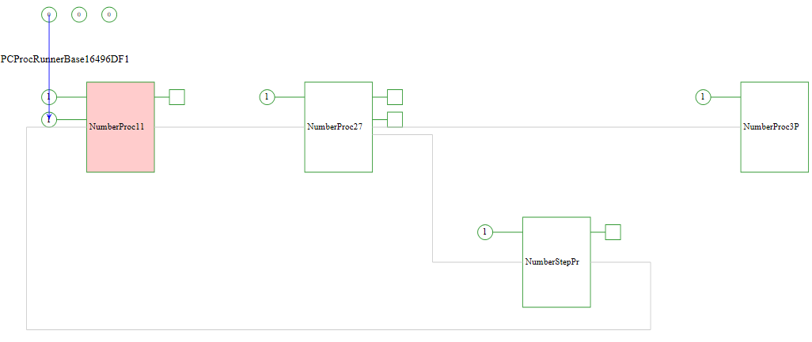
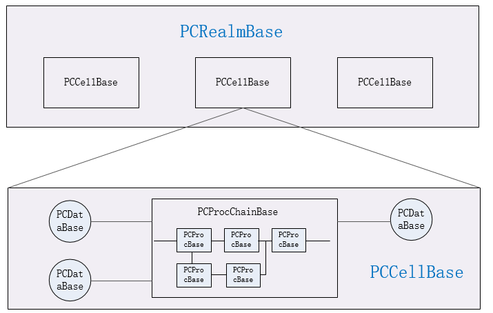

<h1 align="center">Process Chain</h1>

<p  align="center">Foundation of flexible, shareable and creative data-driven programming technology</p>



Introduction
----
   
Current programming uses pre-designed logic, which consist of multiple processes that are combined in a carefully designed sequence to perform specific functions. In a logical sequence, although there are branches or choices, these branches and choices are also pre-designed. This programming method is completely under the control of the designer, reflecting the designer's thinking and wisdom. Designers have a complete understanding of the processing  procedure of information and data, the program can complete the processing of information and data according to the designer's way of thinking, the designer's wisdom makes the program realized in this way efficient. However, this method lacks flexibility, adaptability and creativity. In the process of data processing, the relationship between data and data, the relationship between data and process is transparent. It is not easy to get the relationship between data and data, data and process. It is also not easy to adjust the processing logic based on the desired result. When the expected result changes, the designer needs to adjust the logic of data processing, design new logic, and develop new programs.
    
The current development of programming technology focuses on programming languages (the rise of various programming languages, constantly updated, and constantly introducing new versions), improving performance, simplifying grammar, reducing or eliminating programming errors, and simplifying the concurrent process. But in terms of programming, it is still based on traditional logic sequences, without paying too much attention to flexibility, adaptability and creativity.
    
The process chain is a new programming technology aim to increase the flexibility and buildability of the program. The process chain introduces the management of data and processes, adds definitions of data management types, descriptions of process input data types, and output data types so that process chains can be built based on input data types and output data object types. The scheduling of data objects is the core of the process chain. During execution, the process chain automatically matches or controls the data objects based on the it's type, and the process processes the data until there are no new data or processes. 

The process chain records the relationship between data objects and the relationship between data and processes. These relationships can be used as the basis for future data object processing.

**The process chain is still in its infancy and related issues are still being explored.**

Process chain features
-----

The process chain introduces data management objects and process management objects. The process management object glues input data objects and output data objects.

* Build process chains with different strategies to control and modify each step of data processing.
* Automatically match process objects and execute process objects based on the type of data object
* Support for asynchronous process, running with separate threads
* Data objects support setting **[Tag](./doc/about_tag.md)** and Tick. Data objects with the same tag, different values and Tick can form a sequence. The tag is a string which can act as key index for database or node of graph network. Tag is type name or a string of 40 characters
* Data objects can be assigned to multiple cells for processing at the same time. Each cell can be created for different processing purposes. **[sample](./examples/datatomultiproc.py)**
* Data types can define properties
* Process or process chain objects has a **[Tag](./doc/about_tag.md)** can be obtained via GetTag. The tag is also a string which can act as key index for database or node of graph network. Tag is type name or a string of 40 characters
* New data objects or process objects can be added at any time during the execution of the process chain as needed to implement flexible processing logic.
* Support for running processes directly on data objects, or collections of data objects [Example](./examples/data_runproc.py)
* Data, process and process chain can register callback functions through RegCallBack to perform some processing when these objects are released.
* At any time, you can create realm, add data and procedures, execute and get results. You can also perform a simple process via a data object or through the realm RunProc functions.
* Support for **[refining](#)**, by dynamically define new sub data types based on the results of data object classification or relation, and correct the data type output by the process dynamically through [OnOutputDataToEnv](./doc/pcrealmbase.md) callback of realm.
* Process chains can be stored in json string format and can be published to the internet for easy sharing between applications.
* Support package management, can package data objects and processing objects to publish

**[The process chain can be in the form of a string, which is easy to publish, exchange, and share. It is flexible to construct a process chain, or create a process chain under the guidance of rules. The process chain generates data relationships between data objects and process objects in the execution process, which can be used as the basis for learning and knowledge acquisition.](#)**

Basic objects and tools supported by the process chain
-----

The process chain implements the following classes:

* [PCRealmBase](./doc/pcrealmbase.md), which manages and schedule pcdatas and pccells. 
* [PCDataBase](./doc/pcdatabase.md). The basis of data management, stores the actual values, record the relationship between data and process. 
* [PCDataSetBase](./doc/pcdatasetbase.md). Subclass of pcdatabase which manage multiple data objects.
* [PCProcBase](./doc/pcprocbase.md). The base class of the process. it manages input and output data types, and the execution function of the process.
* [PCProcChainBase](./doc/pcprocchainbase.md). The base class of the process chain, which stores multiple process objects.
* [PCCellBase](./doc/pccellbase.md),  Subclass of pcprocbase, basic scheduling unit, which may contain multiple process chains.

The most basic is the pcdatabase and pcprocbase. The relationship between them is as follows,



**[Note : PCCellBase is subclass of PCProcBase](#)**

Process Chain Programming Documentation:[pchain](./doc/pchain.md)

**Process chain related tools:**

* [pchain.module](./doc/pchain.module.md)
* [pydata.module](./doc/pydata.module.md)
* [pyproc.module](./doc/pyproc.module.md)

Installation
------

The core of the process chain is developed in C language based on [STARCORE](https://github.com/srplab), and other code is developed in Python language. The core library of starcore has been integrated into the pchain. If you need cle interface and programming related information, please install starcore from the above site.

* **[pip install pchain](#)**

or 

* Clone the process chain locally and run **[python setup.py install](#)**

Hello World
------

```python
import pchain
from pchain import pyproc

Service = pchain.cleinit()
realm = Service.PCRealmBase()

@pyproc.DefineProc('HelloWorldProc',None,None)
def Execute(self) :  
  print('Hello world !')
  return (0,1,None)

realm.RunProc(None,None,HelloWorldProc)

pchain.cleterm() 
```

[example download](./examples/hello_world.py)

Write first app
------

* **step 1 : pchain initialization**

```python
import sys
import os
import pchain
from pchain import pydata
from pchain import pyproc
from pchain.pydata import PCPyDataClass
from pchain.pyproc import PCPyProcClass

Service = pchain.cleinit()
import libstarpy

realm = Service.PCRealmBase()
```

1. Import the modules pchain, pydata, and pyproc, class PCPyDataClass and PCPyProcClass.
2. Initialize pchain, this function returns a cle service object.
3. Import the modules libstarpy
4. Create an instance of PCRealmBase

* **step 2 : define data type**

```python
pydata.DefineType('NumberClass',int)
```

* **step 3 : define process type**

```python
@pyproc.DefineProc('AddProc',(NumberClass,NumberClass),NumberClass)
def Execute(self,num1,num2) :  
  Context = self.Context  #  first must save Context in local variable
  return (0,1,NumberClass(num1.value()+num2.value))
```  

* **step 4-1 : run via realm's function "ExecuteForResult"**
 
1. Create instance of PCCellBase, add data and process to be handled to cell

```python
cell = Service.PCCellBase()
cell.AddProc(AddProc)
cell.AddEnvData(realm,NumberClass(1),NumberClass(2))
```

2. Add cell to realm, then execute

```python
realm.AddCell(cell)
result = realm.ExecuteForResult()
print(result[0])
```

* **step 4-2 : run via realms's function "RunProc"**

```python
# 1+2
result = realm.RunProc((NumberClass(1),NumberClass(2)),None,AddProc)
print(result[0])

# 1+2+3+4
result = realm.RunProc((NumberClass(1),NumberClass(2),NumberClass(3),NumberClass(4)),None,AddProc)
print(result[0])
```

* **step 5 : pchain termination**

```python
pchain.cleterm() 
```

[example download](./examples/first_app.py)

How the process chain executes
------

The execution of the process chain is driven by data. The basic execution unit is the cell, and the object that manages the cell is called realm. When executed, the data is allocated to the cell, and the realm will schedule the cells to run in turn. Whether the execution is finish or not of the cell is different from the traditional function, the traditional function returns after the last statement, indicating the end, while the cell's status does not change indicates the execution ends. The state does not change means that no new data is generated, and new process is added. All processes in the cell are either finished running or error. Of course, a process in the Cell can also call the Cell's Finish function to stop the execution of the Cell.
    
Assign the data to the Cell, add the cell to the realm, and then start execution. The process chain engine will schedule the cells in turn. Here's a simple example:

The example is to enter two numbers and then calculate their sum.

```python
import sys
import os
import pchain
from pchain import pydata
from pchain import pyproc
from pchain.pydata import PCPyDataClass
from pchain.pyproc import PCPyProcClass

Service = pchain.cleinit()
import libstarpy

realm = Service.PCRealmBase()

# Define data types
pydata.DefineType('NumberClass')

# Define procedure types
@pyproc.DefineProc('InputProc',None,NumberClass)
def Execute(self) :  
  Context = self.Context  #  first must save Context in local variable
  if Context['SelfObj'].Status < 0 :
    return None
  val = input('input a number : ')
  return (4,1,NumberClass(val))

# Define procedure types
@pyproc.DefineProc('OutputProc',(NumberClass,NumberClass),None)
def Execute(self,num1,num2) :  
  Context = self.Context  #  first must save Context in local variable
  print('sum = ', num1.value() + num2.value())
  Context['Cell'].Finish()
  return (0,1,None)
    
cell = Service.PCCellBase()
cell.AddProc(InputProc,OutputProc)

realm.AddCell(cell)
realm.Execute()
```

**Note: The defined process can be called directly or using [RunProc/RunProcEx/RunString/RunStringEx](./doc/pcrealmbase.md)**

The RunProc/RunProcEx input parameters include the input data object, the expected output data type (which may be None), and the process to be performed, which can specify multiple processes.

Pchain automatically creates a Cell, adds the input process to the Cell, then passes the Cell to the realm, and then executes

If it is one process, RunProc/RunProcEx is the same

If there are multiple processes, RunProc processes multiple processes in parallel, and RunProcEx joins multiple processes together to form a process chain and then execute.

RunString/RunStringEx input parameters are JSON strings or parameter packages into which JSON strings are converted.

The JSON string is a string obtained by the SaveObject function in the procedure or procedure chain.

```python

...

realm.RunProc(None,None,OutputProc,InputProc)
```

**Scheduling large numbers of data objects is a time consuming operation**

Encapsulate python function
----

Depending on the input and output of the function, you can easily convert a python function to a process of the pchain by defining the data management type.

[Example](./examples/pyfunction.py),

```python
def PyFun(a,b,c) :
  print('input :',a,b,c)      
  val = a + b + c
  return val
```

Convert the above PyFun to pchain and run.

* Step 1 : Define input and output parameter types

```python
pydata.DefineType('PythonNumberClass')
```

* Step 2 : Define the procedures in the pchain. 

```python
pyproc.DefineRawProc('PyFuncProc',(PythonNumberClass,PythonNumberClass,PythonNumberClass),PythonNumberClass,PyFun)
```

**[Run](#)**

Create a PyFuncProc instance and execute

```python
func = PyFuncProc()
result = func(PythonNumberClass(1.0),PythonNumberClass(2.0),PythonNumberClass(3.0))
print(result)

or
result = PyFuncProc.call(PythonNumberClass(1.0),PythonNumberClass(2.0),PythonNumberClass(3.0))
print(result)

```

**[Note: You can check the result is generated by which process and based on which data , as follows:]()**

```python
print(result.Wrap().GetSource())
print(result.Wrap().GetOwnerProc())
```

The output is

```
[1.0,2.0,3.0]
PyFuncProc
```

Ecapsulate python class
----

It is simple, here is an example,

```python
class pyclass :
  def pyfunc(self,a,b,c) :
    return a+b+c

pydata.DefineType('PythonObjectClass',pyclass)
pydata.DefineType('PythonNumberClass')

@pyproc.DefineRawProc('PyFuncProc',(PythonObjectClass,PythonNumberClass,PythonNumberClass,PythonNumberClass),PythonNumberClass)
def PyFun(obj,a,b,c) :
  print('input :',obj,a,b,c)      
  return obj.pyfunc(a,b,c)

func = PyFuncProc()
result = func(PythonObjectClass(pyclass()),PythonNumberClass(1.0),PythonNumberClass(2.0),PythonNumberClass(3.0))

or

result = PyFuncProc.call(PythonObjectClass(pyclass()),PythonNumberClass(1.0),PythonNumberClass(2.0),PythonNumberClass(3.0))
```  

Asynchronous execute
----

Pchain supports asynchronous execute. When the [IsAsync](./doc/pcprocbase.md) property of the process object is true, a separate thread will be created to execute the process.

You can also define process objects that are executed asynchronously using DefineAsyncProc and DefineAsyncRawProc.

For example,

```python
pydata.DefineType("UrlClass")
pydata.DefineType("WebPageClass")

# this proc will be blocked
@pyproc.DefineAsyncProc('DownLoadUrlProc',UrlClass,WebPageClass)
def Execute(self,url) :
  Context = self.Context  #  first must save Context in local variable
  SelfObj = Context["SelfObj"]

  try:    
    libstarpy._SRPUnLock()  # release cle lock, before enter wait
    import urllib2
    req = urllib2.Request(url.value())
    fd = urllib2.urlopen(req)
    result = fd.read()
    libstarpy._SRPLock()    # capture cle lock,
    return (0,1,WebPageClass(result))         
  except Exception as exc:
    libstarpy._SRPLock()    # capture cle lock,
    return (0,1,None)   

print(DownLoadUrlProc.GetType().IsAsync)
Result = DownLoadUrlProc.call(UrlClass('http://www.srplab.com'))
print(Result)
```

**[Asynchronous execution using separate threads, before entering the time-consuming operation, you need to call _SRPUnLock to unlock, and then call _SRPLock after exiting.](#)**

Running process on data object or data set object
----

The data object supports RunString and RunProc functions, which can directly use the data object as input, run the process, and get the output result.

for example,

```python
# Define data types
pydata.DefineType('StringClass',str)
pydata.DefineType('IntegerClass',int)

# Define procedure types
@pyproc.DefineProc('StringLengthProc',StringClass,IntegerClass)
def Execute(self,input_str) :  
  Context = self.Context  #  first must save Context in local variable
  return (0,1,IntegerClass(len(input_str.value())))

d2 = StringClass("aaaa")
print(d2.RunProc(StringLengthProc))

d3 = StringClass("sssssssssssss")
set1 = Service.PCDataSetBase.Create(d2,d3)
print(set1.RunProc(StringLengthProc))
```

the output is 

```txt
4
[4,13]
```


Text format of process chain
------

The process chain can be stored as a string in json format, or it can be recovered from a string, sent to the internet, or downloaded from the Internet to run locally. The following is an example of a process chain.

```
{
	"PackageInfo": [
		{
			"PackageName": "grab_url_img_package",
			"PackageVersion": "1.0.0",
			"PackageUrl": "http://127.0.0.1/grab_url_img_package.1.0.0.zip"
		}
	],
	"ObjectList": [
		{
			"Type": "PCProcChain",
			"PCProcBase": [
				{
					"ClassName": "grab_url_img_package.DownloadHtmlProc",
					"ObjectID": "7de8b486-22aa-42c1-b3da-f2a899133d0c",
					"InputQueue": [
						{
							"RequestNumber": 1,
							"DataBaseName": "grab_url_img_package.UrlClass"
						}
					],
					"OutputQueue": [
						{
							"DataBaseName": "grab_url_img_package.HtmlClass"
						}
					],
					"Type": "PCProc"
				},
				{
					"ClassName": "grab_url_img_package.ParseImageUrlProc",
					"ObjectID": "12d8dbdb-fe9e-46b6-9080-3be1fa1bbf41",
					"InputQueue": [
						{
							"RequestNumber": 1,
							"DataBaseName": "grab_url_img_package.HtmlClass"
						}
					],
					"OutputQueue": [
						{
							"DataBaseName": "grab_url_img_package.ImageUrlClass"
						}
					],
					"Type": "PCProc"
				},
				{
					"ClassName": "grab_url_img_package.DownloadImageProc",
					"ObjectID": "48bc33b7-d41e-45f9-93e5-7ac1edeccb24",
					"InputQueue": [
						{
							"RequestNumber": 1,
							"DataBaseName": "grab_url_img_package.ImageUrlClass"
						}
					],
					"OutputQueue": [
						{
							"DataBaseName": "grab_url_img_package.ImageClass"
						}
					],
					"Type": "PCProc"
				}
			]
		}
	]
}
```

[Load and Run](../examples/using_package_string_net.py)

Process chain strings can be loaded and run

```python
proc_str = r'''{"PackageInfo":[{"PackageName":"grab_url_img_package","PackageVersion":"1.0.0","PackageUrl":"http://127.0.0.1/grab_url_img_package.1.0.0.zip"}],"ObjectList":[{"Type":"PCProcChain","PCProcBase":[{"ClassName":"grab_url_img_package.DownloadHtmlProc","ObjectID":"7de8b486-22aa-42c1-b3da-f2a899133d0c","InputQueue":[{"RequestNumber":1,"DataBaseName":"grab_url_img_package.UrlClass"}],"OutputQueue":[{"DataBaseName":"grab_url_img_package.HtmlClass"}],"Type":"PCProc"},{"ClassName":"grab_url_img_package.ParseImageUrlProc","ObjectID":"12d8dbdb-fe9e-46b6-9080-3be1fa1bbf41","InputQueue":[{"RequestNumber":1,"DataBaseName":"grab_url_img_package.HtmlClass"}],"OutputQueue":[{"DataBaseName":"grab_url_img_package.ImageUrlClass"}],"Type":"PCProc"},{"ClassName":"grab_url_img_package.DownloadImageProc","ObjectID":"48bc33b7-d41e-45f9-93e5-7ac1edeccb24","InputQueue":[{"RequestNumber":1,"DataBaseName":"grab_url_img_package.ImageUrlClass"}],"OutputQueue":[{"DataBaseName":"grab_url_img_package.ImageClass"}],"Type":"PCProc"}]}]}'''
pkg = Service._ServiceGroup._NewParaPkg()
pkg._FromJSon(proc_str)
print(loader.loadobjectpackage(pkg))

#restore object
loadobjects = realm.LoadObject(pkg,False)

#call process
UrlClass = pydata.UnWrap(Service.UrlClass)
result = realm.RunProc(UrlClass('http://www.srplab.com/en/index.html'),None,loadobjects[0])
print(result)
```

Interaction with other programming languages
-----

Pchain develops based on the cle platform and supports multiple languages. Both data and processes can be developed in other languages.

[interop_with_c](./doc/interop_with_c.md) is an example of a process for adding two numbers using c language

[interop_with_java](./doc/interop_with_java.md) is an example of a process for adding two numbers using java language

You can create an instance of a Realm object in a different language and then define a callback function for the instance. Handling OnBeforeExecute, OnCellFinish and other callback functions

[interop_with_java_realm_callback](./doc/interop_with_java_realm_callback.md) is an example.


<h2 align="center"><a href="./doc/pchain.md">Next Topic : pchain<a></h2>


